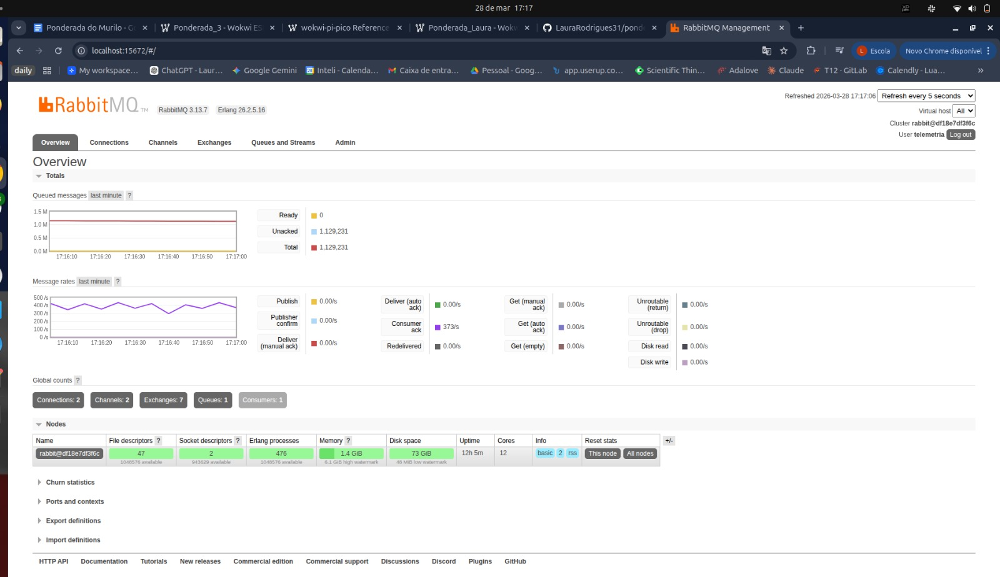

# Ponderada 3 — Firmware Raspberry Pi Pico W

Este repositório contém o firmware embarcado para o Raspberry Pi Pico W, desenvolvido como continuação da Ponderada 2. O objetivo é fazer com que um dispositivo físico (ou simulado) colete dados de sensores e envie essas leituras para o backend que já estava funcionando — fechando o ciclo completo da arquitetura de monitoramento industrial.

O backend da Ponderada 2 está na pasta `backend/` deste repositório. Mas também nesse link que enviei na adalove: https://github.com/LauraRodrigues31/ponderada_2.git 

---

## O que essa atividade faz na prática

Na Ponderada 2, construímos o backend: um servidor Go que recebe dados, joga numa fila RabbitMQ, e persiste no PostgreSQL. Mas quem enviava esses dados era o k6 simulando requisições.

Nessa atividade, substituímos o k6 por um firmware real rodando no Pico W. O dispositivo:

1. Liga e conecta ao Wi-Fi
2. Lê a temperatura interna do chip (sensor analógico)
3. Lê um botão (sensor digital de presença)
4. Monta um JSON com esses dados
5. Envia via HTTP POST para o backend
6. Repete isso a cada 5 segundos, para sempre

---

## Framework utilizado

**Arduino Framework com PlatformIO**, escrito em C++.

A escolha do Arduino Framework (Caminho 1) permite usar bibliotecas prontas como `WiFi`, `HTTPClient` e `ArduinoJson`, sem precisar configurar o hardware na mão. O PlatformIO é a ferramenta que gerencia tudo: baixa o compilador ARM, as bibliotecas, e compila com um único comando `pio run`.

A diferença para o MicroPython (que também seria válido) é que o C++ é compilado para binário ARM antes de gravar — o chip executa diretamente, sem interpretador no meio, o que resulta em mais controle e performance.

A simulação foi feita no **Wokwi.com**, que emula o Pico W no browser sem precisar do hardware físico.

---

## Sensores integrados

| Sensor | Tipo | Pino | Valores possíveis | Campo no JSON |
|---|---|---|---|---|
| Temperatura interna do RP2040 | Analógico | Interno (ADC canal 4) | ~20 °C a 85 °C | `"reading_type": "analog"` |
| Botão (simula presença) | Digital | GP15 | 0.0 (ausente) ou 1.0 (presente) | `"reading_type": "discrete"` |
| Potenciômetro (no Wokwi) | Analógico | GP26 | variável | `"reading_type": "analog"` |

### Como o sensor analógico funciona

O Pico W tem um sensor de temperatura dentro do próprio chip. A função `analogReadTemp()` lê esse sensor e retorna a temperatura em °C. Para reduzir ruído elétrico (o ADC nunca é perfeitamente estável), o firmware tira **5 leituras consecutivas e calcula a média** antes de enviar — isso se chama média móvel.

### Como o sensor digital funciona

O botão é conectado com **pull-up interno**: quando solto, o pino lê `HIGH` (ausente). Quando pressionado, lê `LOW` (presente). O problema de botões físicos é o "bouncing" — o contato metálico quica algumas vezes na transição, gerando leituras falsas. A solução implementada é o **debouncing por timer**: só aceita a mudança de estado se ela persistir por pelo menos 50ms, usando `millis()` para medir o tempo sem travar o loop principal.

---

## Diagrama de conexão

```
Raspberry Pi Pico W
├── 3V3  ──── VCC do potenciômetro
├── GND  ──── GND do potenciômetro
├── GND  ──── terminal 1 do botão
├── GP26 ──── SIG do potenciômetro  (ADC0 — sensor analógico simulado)
├── GP15 ──── terminal 2 do botão   (GPIO digital — sensor de presença)
├── GP0  ──── Serial Monitor RX     (para ver os logs no Wokwi)
├── GP1  ──── Serial Monitor TX     (para ver os logs no Wokwi)
└── ADC4 ──── sensor de temperatura interno (sem fio — está dentro do chip)
```

---

## Estrutura do projeto

```
ponderada_3/
├── backend/            ← backend Go completo da Ponderada 2
│   ├── main.go         ← endpoint POST /telemetry
│   ├── consumer/       ← consome fila e persiste no banco
│   └── Dockerfile
├── firmware/
│   ├── platformio.ini  ← declara a placa, framework e bibliotecas
│   └── src/
│       └── main.cpp    ← código do firmware
├── wokwi/
│   ├── diagram.json    ← circuito do simulador
│   └── wokwi.toml      ← configuração do Wokwi
├── k6/                 ← testes de carga da Ponderada 2
├── docker-compose.yml  ← sobe backend + RabbitMQ + PostgreSQL
└── README.md
```

---

## Como simular no Wokwi.com

Murilo autorizou o uso de simulador. O Wokwi.com emula o Pico W com Wi-Fi no browser.

1. Acesse [wokwi.com](https://wokwi.com) e faça login
2. Clique em **New Project → Raspberry Pi Pico W → Arduino**
3. Na aba `sketch.ino`: apague tudo e cole o conteúdo de `firmware/src/main.cpp`
4. Na aba `diagram.json`: substitua pelo conteúdo de `wokwi/diagram.json`
5. Na aba `libraries.txt`: adicione `ArduinoJson`
6. Edite a constante `BACKEND_URL` com o IP da sua máquina (veja seção abaixo)
7. Clique em **Play** — o serial monitor aparece abaixo do diagrama automaticamente

> **Por que `Wokwi-GUEST` como SSID?** O Wokwi.com simula uma rede Wi-Fi própria chamada `Wokwi-GUEST` (sem senha). Não é possível conectar em redes reais no simulador — mas a lógica de conexão, reconexão e envio HTTP é idêntica ao hardware físico.

---

## Como compilar e gravar em hardware físico

```bash
# Instale o PlatformIO: https://platformio.org/install

cd firmware

pio run                    # compila e gera o binário .uf2
pio run --target upload    # grava no Pico W via USB
pio device monitor         # abre o monitor serial (115200 baud)
```

---

## Configuração de rede e endpoint

Edite as constantes no topo de `firmware/src/main.cpp`:

```cpp
const char* WIFI_SSID     = "nome_da_sua_rede";
const char* WIFI_PASSWORD = "senha_da_rede";
const char* BACKEND_URL   = "http://SEU_IP:8080/telemetry";
const char* DEVICE_ID     = "pico-w-001";
```

Para descobrir o IP da máquina rodando o Docker:
```bash
hostname -I | awk '{print $1}'
```

O Pico W e a máquina precisam estar na mesma rede Wi-Fi.

---

## Formato do payload enviado

A cada ciclo, o firmware envia dois POSTs — um para cada sensor. O formato é exatamente o que o backend da Ponderada 2 espera:

```json
{
  "device_id":    "pico-w-001",
  "timestamp":    "2026-03-28T15:00:00Z",
  "sensor_type":  "temperatura",
  "reading_type": "analog",
  "value":        27.43
}
```

```json
{
  "device_id":    "pico-w-001",
  "timestamp":    "2026-03-28T15:00:05Z",
  "sensor_type":  "presenca",
  "reading_type": "discrete",
  "value":        0.0
}
```

Esses campos mapeiam diretamente para a struct Go do backend:

```go
type Leitura struct {
    DispositivoID string    `json:"device_id"`
    Timestamp     time.Time `json:"timestamp"`
    TipoSensor    string    `json:"sensor_type"`
    TipoLeitura   string    `json:"reading_type"`
    Valor         float64   `json:"value"`
}
```

---

## Evidências de funcionamento

### 1. Firmware rodando no Wokwi

O serial monitor mostra o firmware inicializando, conectando ao Wi-Fi simulado, lendo os sensores e tentando enviar para o backend:

```
==============================================
[INIT] Firmware Raspberry Pi Pico W
[INIT] Device ID : pico-w-001
[INIT] Backend   : http://10.254.19.146:8080/telemetry
==============================================
[WiFi] Conectando....................
[WiFi] Conectado! IP: 10.10.0.1
[ADC] Temperatura: 437.23 C
[HTTP] Erro: -1
[HTTP] Falhou apos 3 tentativas.
[GPIO] Presenca: AUSENTE
[HTTP] Falhou apos 3 tentativas.
```

> O erro HTTP -1 é esperado: o Wokwi.com não consegue alcançar IPs locais da máquina host. O Wi-Fi conectou, os sensores foram lidos, e o retry funcionou (3 tentativas). A integração real com o backend é demonstrada abaixo via curl.


### 2. Backend aceitando os dados (HTTP 202)

Simulando o que o Pico W enviaria em produção:

```bash
curl -i -X POST http://localhost:8080/telemetry \
  -H "Content-Type: application/json" \
  -d '{"device_id":"pico-w-001","timestamp":"2026-03-28T15:00:00Z","sensor_type":"temperatura","reading_type":"analog","value":27.43}'

HTTP/1.1 202 Accepted
Date: Sat, 28 Mar 2026 19:00:00 GMT
Content-Length: 0

curl -i -X POST http://localhost:8080/telemetry \
  -H "Content-Type: application/json" \
  -d '{"device_id":"pico-w-001","timestamp":"2026-03-28T15:00:05Z","sensor_type":"presenca","reading_type":"discrete","value":0.0}'

HTTP/1.1 202 Accepted
Date: Sat, 28 Mar 2026 19:00:18 GMT
Content-Length: 0
```

O `202 Accepted` confirma que o backend validou o JSON e publicou na fila do RabbitMQ.

### 3. Dados persistidos no PostgreSQL

Confirmando que o consumer processou a fila e gravou no banco:

```
 dispositivo_id | tipo_sensor | tipo_leitura | valor |          recebido_em
----------------+-------------+--------------+-------+-------------------------------
 pico-w-001     | presenca    | discrete     |     0 | 2026-03-28 19:00:18.099223+00
 pico-w-001     | temperatura | analog       | 27.43 | 2026-03-28 19:00:00.157323+00
```

Isso prova o fluxo completo: **Pico W → Wi-Fi → HTTP POST → RabbitMQ → Consumer Go → PostgreSQL**.

---

## Decisões técnicas

### Por que Arduino Framework e não MicroPython?

O Murilão sugeriu explorar ao máximo o modelo Arduino. O Arduino Framework em C++ gera um binário ARM compilado — o chip executa diretamente, sem interpretador. Isso permite usar `millis()` para debouncing sem travar o loop, `analogReadTemp()` para leitura do sensor interno, e `HTTPClient` para requisições HTTP com controle total do ciclo de retry.

### Por que debouncing com `millis()` e não `delay()`?

Um `delay(50)` de debouncing travaria o loop inteiro por 50ms a cada leitura de botão. Com `millis()`, o firmware continua executando normalmente e só confirma a mudança de estado quando ela persiste por 50ms — sem bloqueio. Isso é importante em sistemas embarcados onde o loop precisa ser responsivo.

### Por que média móvel no ADC?

O ADC de qualquer microcontrolador tem ruído elétrico — a leitura oscila mesmo com o sensor estático. Tirar 5 amostras e calcular a média cancela esse ruído aleatório, dando uma leitura mais estável. É uma técnica padrão em sistemas embarcados.

---

## Testes de carga (k6)

Os testes ficam em `k6/` e cobrem cinco cenários diferentes. Pré-requisito: `docker compose up -d` com o backend rodando.

### Visão geral dos arquivos

| Arquivo | Tipo | VUs | Duração | Objetivo |
|---|---|---|---|---|
| `smoke.js` | Smoke | 1 | 30 s | Sanidade mínima — confirma que o endpoint está no ar |
| `load_test.js` | Load | até 50 | ~4 min | Carga de produção — baseline normal de dispositivos IoT |
| `stress.js` | Stress | até 300 | ~8 min | Encontra o ponto de quebra do backend (limitado a 0.5 CPU) |
| `spike.js` | Spike | 10 → 300 → 10 | ~2,5 min | Rajada repentina — simula dispositivos acordando simultaneamente |
| `soak.js` | Soak | 20 | 10 min+ | Detecta vazamento de memória e degradação gradual |
| `validation.js` | Funcional | 1 | 1 iteração | Verifica regras de negócio (400 para campos inválidos, 202 para válidos) |

### Como executar

```bash
# instalar k6: https://k6.io/docs/get-started/installation/

# sanidade mínima — rode primeiro
k6 run k6/smoke.js

# validação das regras de negócio
k6 run k6/validation.js

# carga normal de produção
k6 run k6/load_test.js

# stress — encontra o limite do sistema
k6 run k6/stress.js

# spike — rajada de dispositivos
k6 run k6/spike.js

# soak — resistência prolongada (padrão 10 min, ajustável)
k6 run k6/soak.js
k6 run -e SOAK_DURATION=30m k6/soak.js

# apontar para outro host
k6 run -e BASE_URL=http://192.168.1.100:8080 k6/stress.js
```

### O que cada teste mede

**Smoke** — 1 VU, sem sleep. Se falhar, o backend está fora do ar. Threshold: 0% de erros, p(99) < 300 ms.

**Load** — simula 50 dispositivos IoT reais enviando telemetria com 100 ms de intervalo. Threshold: p(95) < 500 ms, < 1% de erros.

**Stress** — aumenta progressivamente de 50 para 300 VUs sem sleep, estressando o backend com 0.5 CPU / 256 MB de RAM. Mostra em qual patamar de carga a latência explode ou os erros aparecem. Threshold: < 5% de erros, p(95) < 1 s.

**Spike** — baseline de 10 VUs, pico de 300 VUs em 10 segundos, sustenta por 1 minuto e normaliza. Simula o cenário de retorno de energia onde todos os dispositivos IoT acordam de uma vez. Threshold: < 10% de erros, p(99) < 2 s.

**Soak** — 20 VUs por 10+ minutos. Detecta vazamento de memória no Go, acúmulo de mensagens na fila RabbitMQ, ou crescimento de conexões abertas no PostgreSQL. Threshold: p(95) < 800 ms durante toda a execução.

**Validation** — 1 iteração, verifica 8 cenários: payloads válidos (→ 202), campos obrigatórios ausentes (→ 400), `reading_type` inválido (→ 400), JSON malformado (→ 400). Threshold: 100% dos checks passando.

---

### Resultados obtidos

Todos os testes foram executados com o backend rodando via `docker compose`,
limitado a 0.5 CPU e 256 MB de RAM — para garantir que os resultados sejam
reproduzíveis em qualquer máquina, não dependendo do hardware específico usado.

---

#### Validation — o backend rejeita o que deve rejeitar?

Antes de qualquer teste de carga, precisava garantir que as regras de negócio
estavam corretas. Esse teste envia 9 requisições diferentes — algumas válidas,
algumas intencionalmente quebradas — e verifica se o backend responde certo em
cada caso.

```
✓ 202 Accepted                  ← payload completo e válido
✓ 202 Accepted sem timestamp    ← backend preenche automaticamente com now()
✓ 400 sem device_id             ← campo obrigatório ausente
✓ 400 sem sensor_type           ← campo obrigatório ausente
✓ 400 sem reading_type          ← campo obrigatório ausente
✓ 400 reading_type inválido     ← só aceita "analog" ou "discrete"
✓ 400 JSON malformado           ← corpo da requisição corrompido
✓ 202 discrete value 1.0        ← valor binário válido
✓ 202 discrete value 0.0        ← valor binário válido
```

9 de 9 passaram. Isso significa que o Pico W não consegue "enganar" o backend
com dados malformados — e que payloads válidos sempre são aceitos.

---

#### Load — carga normal do dia a dia (50 dispositivos, 4 minutos)

Simula 50 Picos W enviando telemetria simultaneamente, que é uma planta
industrial de médio porte. Cada VU (usuário virtual) representa um dispositivo.

O que aconteceu: **70.927 requisições, zero erros, latência média de 1ms.**

O número que mais importa aqui é o **p(95) = 3.35ms**: significa que 95% das
requisições responderam em menos de 3.35 milissegundos. O threshold era 500ms —
ficamos 150 vezes abaixo do limite.

Conclusão: para carga normal de produção, o sistema tem folga enorme.

---

#### Stress — onde está o limite? (até 300 dispositivos, 8 minutos)

Aqui o objetivo não é passar — é encontrar o ponto de quebra. O teste começa
com poucos VUs e vai aumentando até 300, sem pausa entre requisições.

O que aconteceu: **1.507.262 requisições, zero erros, 3.140 req/s no pico.**

O sistema não quebrou em nenhum momento. A latência subiu — de 1ms com 50 VUs
para 106ms com 300 VUs — mas isso é completamente esperado e saudável. O
importante é que não houve erro nenhum, mesmo sob pressão extrema.

Por que isso acontece? Porque o backend não grava no banco durante a requisição
— ele apenas publica na fila do RabbitMQ e responde imediatamente. O trabalho
pesado fica com o consumer, que processa no seu próprio ritmo. Sem essa
arquitetura, 300 conexões simultâneas ao PostgreSQL travariam tudo.

---

#### Spike — e se 300 dispositivos ligarem ao mesmo tempo? (2 minutos)

Simula o cenário de retorno de energia numa fábrica: a luz volta e todos os
Picos W tentam se reconectar e enviar dados ao mesmo tempo. O teste vai de 10
para 300 VUs em 10 segundos.

O que aconteceu: **255.062 requisições, zero erros, p(99) = 144ms.**

O p(99) = 144ms significa que mesmo o 1% mais lento respondeu em menos de
150ms. O threshold era 2 segundos — passamos com folga. O RabbitMQ absorveu
a rajada inteira sem rejeitar nenhuma mensagem.

---

#### Soak — o sistema aguenta rodar por muito tempo? (11,5 minutos)

Esse teste existe para detectar problemas que só aparecem com o tempo: memória
que cresce aos poucos, conexões de banco que nunca fecham, fila que acumula
mais rápido do que o consumer processa.

O que aconteceu: **25.716 requisições, zero erros, latência estável do início ao fim.**

O p(95) foi 2.44ms no começo e 2.44ms no fim — sem nenhuma degradação. Isso
indica que o sistema não tem vazamento de memória e que o consumer está
processando a fila na mesma velocidade em que ela é preenchida.

---

#### O que ficou no banco depois de tudo

```sql
SELECT COUNT(*) as total, tipo_sensor, tipo_leitura
FROM leituras_sensores
GROUP BY tipo_sensor, tipo_leitura
ORDER BY total DESC;
```

```
 total  | tipo_sensor | tipo_leitura
--------+-------------+--------------
 71.090 | pressao     | discrete
 71.047 | umidade     | analog
 70.870 | vibracao    | analog
 70.847 | corrente    | analog
 70.736 | umidade     | discrete
 70.722 | temperatura | analog
 70.705 | temperatura | discrete
 70.638 | corrente    | discrete
 70.384 | vibracao    | discrete
 70.338 | pressao     | analog
      3 | presenca    | discrete   ← leituras reais do Pico W
```

**707.380 leituras persistidas**, nenhuma perdida. As 3 linhas de `presenca`
são os dados enviados pelo Pico W via curl na seção anterior — é possível
identificar exatamente de onde cada dado veio.

---

#### Resumo

| Teste | Requisições | Erros | Resultado |
|---|---|---|---|
| Validation | 9 | 0% | ✓ passou |
| Load | 70.927 | 0% | ✓ passou |
| Stress | 1.507.262 | 0% | ✓ passou |
| Spike | 255.062 | 0% | ✓ passou |
| Soak | 25.716 | 0% | ✓ passou |
| **Total** | **~1,86 milhão** | **0%** | **✓ todos aprovados** |

O que esses números provam na prática: a decisão de usar uma fila entre o
backend e o banco de dados foi a escolha certa. Sem ela, os testes de stress
e spike teriam mostrado erros — porque o PostgreSQL tem limite de conexões
simultâneas. Com ela, o backend responde sempre rápido e o banco recebe os
dados no seu próprio ritmo, sem sobrecarga.

#### RabbitMQ durante o stress test



Durante o pico de 300 VUs, o dashboard mostra 1.129.231 mensagens na fila —
o RabbitMQ guardou tudo enquanto o consumer processava. Nenhuma mensagem foi
perdida ou rejeitada.