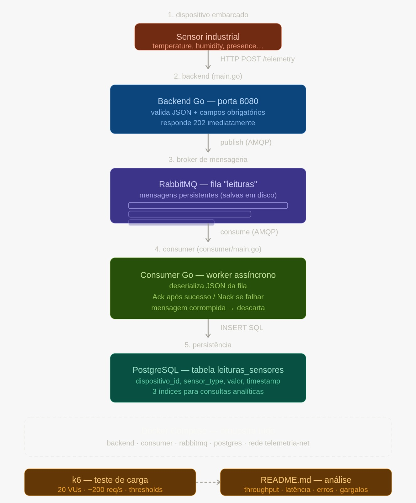

# Ponderada 2 - Laura Rodrigues

A solução proposta consiste no desenvolvimento de um backend em GoLang que exponha um endpoint HTTP do tipo POST, responsável por receber pacotes de telemetria enviados por dispositivos embarcados. Cada requisição contém identificação do dispositivo, timestamp, tipo de sensor, tipo de leitura e o valor medido. Os dados são publicados em uma fila RabbitMQ e persistidos no PostgreSQL por um consumer dedicado.

## FLuxo do sistema 




## Modelo de dados (`init.sql`)

O banco de dados possui uma única tabela chamada `leituras_sensores`, que armazena todas as leituras de sensores industriais.

### Estrutura da tabela

| Coluna | Tipo | Descrição |
|---|---|---|
| `id` | `BIGSERIAL` | Chave primária autoincrementada |
| `dispositivo_id` | `VARCHAR(64)` | Identificador do dispositivo/sensor |
| `tipo_sensor` | `VARCHAR(64)` | Tipo do sensor (ex: temperatura, pressão) |
| `tipo_leitura` | `VARCHAR(8)` | Categoria da leitura: `analog` ou `discrete` |
| `valor` | `DOUBLE PRECISION` | Valor medido pelo sensor |
| `timestamp` | `TIMESTAMPTZ` | Horário em que o dispositivo registrou a leitura |
| `recebido_em` | `TIMESTAMPTZ` | Horário em que o banco recebeu o dado (preenchido automaticamente) |

### Decisões tomadas

 O arquivo `init.sql` cria a estrutura do banco de dados que vai armazenar todas as leituras dos sensores. A tabela principal, `leituras_sensores`, foi desenhada para funcionar tanto com sensores que geram valores contínuos (como temperatura e umidade) quanto com os que geram valores binários (como presença ou abertura de válvula), usando uma única coluna de valor numérico com uma restrição que impede entradas inválidas diretamente no banco. Cada registro guarda dois momentos de tempo: quando o sensor fez a leitura e quando o sistema recebeu o que permite identificar atrasos no processamento. Também foram criados três índices para acelerar as consultas mais comuns: buscar por dispositivo, por período de tempo, e a combinação dos dois.


## Infraestrutura (`docker-compose.yml`)

O `docker-compose.yml` é o arquivo que orquestra todos os serviços da aplicação, permitindo subir o ambiente inteiro com um único comando. Ele define quatro serviços: o banco PostgreSQL, o RabbitMQ, o backend e o consumer cada um rodando em seu próprio container mas conectados numa rede virtual interna chamada `telemetria-net`, o que permite que eles se comuniquem pelo nome (o backend acessa o RabbitMQ simplesmente chamando `rabbitmq:5672`, por exemplo). O banco e o RabbitMQ têm healthchecks configurados, garantindo que o backend e o consumer só iniciem depois que esses serviços estiverem realmente prontos para receber conexões. As credenciais foram definidas com um usuário dedicado `telemetria` em vez das credenciais padrão. Por segurança, as portas do banco e da fila não ficam expostas para fora do ambiente Docker  apenas o backend na porta 8080 e o painel de gerenciamento do RabbitMQ na 15672 ficam acessíveis externamente.


## Backend e Consumer (`backend/`)

O backend é um servidor HTTP escrito em Go que expõe o endpoint `POST /telemetry`. Quando um sensor envia uma leitura, o servidor valida os campos obrigatórios  `device_id`, `sensor_type`, `reading_type` e `value`  e publica a mensagem na fila do RabbitMQ, respondendo imediatamente com status 202 sem esperar o dado ser gravado no banco. Isso é o que garante que o servidor nunca trave por causa de lentidão no banco ou no consumer. As mensagens são publicadas com modo persistente, o que significa que o RabbitMQ as salva em disco se o serviço reiniciar antes do consumer processar, nenhuma leitura é perdida.

O consumer é um processo separado que fica escutando a fila continuamente. Para cada mensagem recebida, tenta inserir a leitura na tabela `leituras_sensores`. A confirmação para o RabbitMQ só acontece depois que a inserção no banco é bem-sucedida  se der erro, a mensagem volta para a fila para ser tentada novamente. Mensagens com formato inválido são descartadas diretamente, já que tentar reprocessá-las não resolveria nada.

O Dockerfile usa uma estratégia de múltiplos estágios: o primeiro estágio compila os dois binários (backend e consumer) usando a imagem completa do Go, e os estágios seguintes geram imagens finais mínimas contendo apenas o executável necessário, sem código-fonte nem ferramentas de compilação. Isso resulta em containers menores e mais seguros em produção.


## Teste de carga (`k6/load_test.js`)

O script de teste simula sensores industriais enviando leituras simultaneamente para o endpoint `POST /telemetry`. O teste é dividido em três estágios: uma subida gradual até 20 usuários virtuais em 30 segundos, uma sustentação desse nível por 1 minuto, e uma descida gradual em 20 segundos  imitando o comportamento real de sensores sendo ligados, operando e desligados. Cada usuário virtual representa um sensor disparando requisições em loop com 100ms de intervalo, o que resulta em aproximadamente 200 requisições por segundo no pico.

Os dados gerados pelo script são variados e realistas: 50 dispositivos diferentes, 5 tipos de sensor, e os valores respeitam o tipo de leitura `0 ou 1` para leituras discretas e números decimais para leituras analógicas. Dois critérios de aprovação foram definidos: 95% das requisições devem responder em menos de 500ms, e a taxa de erro deve ficar abaixo de 1%. Esses thresholds fazem o teste terminar com falha automaticamente caso o sistema não os atinja, tornando a avaliação objetiva.

## Como executar

### Subir o ambiente

```bash
docker compose up --build
```

Aguarde todos os serviços ficarem saudáveis. O backend estará disponível em `http://localhost:8080` e o painel do RabbitMQ em `http://localhost:15672` (usuário e senha: `telemetria`).

### Testar manualmente

opicional para verificar se o endpoint responda antes de rodar ok6. Rodando confirma se retorna 202.

```bash
curl -i -X POST http://localhost:8080/telemetry \
  -H "Content-Type: application/json" \
  -d '{"device_id":"sensor-01","timestamp":"2024-01-15T10:30:00Z","sensor_type":"temperatura","reading_type":"analog","value":23.5}'
```

### Rodar o teste de carga

```bash
k6 run k6/load_test.js
```

### Derrubar o ambiente

```bash
docker compose down -v
```

O flag `-v` remove o volume do banco. Omita-o se quiser preservar os dados entre execuções.

## Resultados do teste de carga

O teste foi executado com 20 usuários virtuais simultâneos durante 1 minuto e 50 segundos, com o container do backend limitado a 0.5 núcleos de CPU e 256MB de memória — configuração que garante reprodutibilidade independente do hardware utilizado.

### Resultados com limite de 0.5 CPU

| Métrica | Resultado | Threshold |
|---|---|---|
| Throughput | 152.28 req/s | — |
| Latência média | 1.20ms | — |
| Latência p(95) | 2.66ms | < 500ms |
| Taxa de erros | 0.00% | < 1% |
| Requisições totais | 16.753 | — |

Os dois thresholds definidos foram atendidos com ampla margem: o p(95) de 2.66ms ficou 187x abaixo do limite de 500ms, e nenhuma requisição falhou.

### Comparação antes e depois do limite de CPU

| Métrica | Sem limite | Com 0.5 CPU |
|---|---|---|
| Throughput | 152.40 req/s | 152.28 req/s |
| Latência média | 1.04ms | 1.20ms |
| p(95) | 2.05ms | 2.66ms |

A variação mínima entre os dois cenários indica que o backend Go não chegou a pressionar o limite de 0.5 CPU durante o teste — a arquitetura é eficiente o suficiente para que o gargalo esteja no intervalo entre requisições simulado pelo k6, e não no processamento em si.

### Projeção de capacidade

Usando os resultados com 0.5 CPU como base:

- 0.5 CPU → 152 req/s
- 1.0 CPU → ~304 req/s (estimativa)
- 2.0 CPUs → ~608 req/s (estimativa)

### Análise

A baixa latência é consequência direta da arquitetura desacoplada: o backend responde imediatamente após publicar na fila do RabbitMQ, sem aguardar a gravação no banco. O trabalho pesado acontece no consumer em paralelo, invisível para quem fez a requisição. Vale observar que o ambiente é local — em produção, com latência de rede entre os serviços, os números absolutos seriam diferentes, mas o comportamento sob carga seria semelhante graças à fila absorver os picos.


